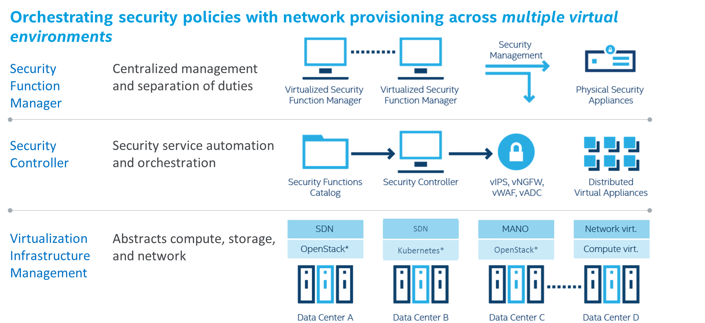
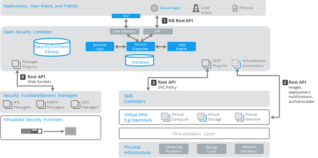

# Open Security Controller Architecture

## Overview

### Background
Datacenter technologies have evolved into Software Defined Infrastructure (SDI) architectures where compute, network and storage resources are centrally managed by intelligent control layers. Similarly, there is a need for a software defined security controller which can automate and orchestrate security services across multiple cloud environments and datacenters. The primary goal for Open Security Controller (OSC) is to be this software defined security orchestrator.

### SDN/NFV Security Challenges
This section summarizes security challenges faced by enterprises, cloud service providers and telecommunications providers, which are addressed by OSC.

#### Enterprises
It is common for enterprise applications to be hosted across multiple datacenter technologies in both private and public clouds. The security administrator requires the ability to configure and validate consistent granular security controls across these cloud environments. The key requirement is to allow the security administrator to centrally define these security controls and associated policies across multiple diverse datacenter environments.

#### Cloud Service Providers
Cloud service providers want to offer security services as a value-add to their customers. This requires an automated security services orchestration capability where tenants can chose required security controls from an online catalog and associated policies for these controls.

#### Telecommunication Providers
Telecommunications providers want to reduce time to market and costs for infrastructure by transforming the legacy to SDN/NFV technology. However, security monitoring for the virtualized infrastructure is still a gap. There is a need for a centralized security orchestration solution which fully automates the security monitoring of the virtualized infrastructure.

OSC is designed to address these SDN/NFV security challenges by playing a role of a centralized security services orchestration tool across multiple cloud environments. It does so using a modular architecture to interface with:
*	Multi-vendor virtualized security function managers ([Security Manager Plugins](../plugins/security_mgr_plugin.md))
*	Multi-vendors SDN controllers ([SDN Controller Plugins](../plugins/sdn_controller_plugin.md))
*	Virtualization infrastructure Managers ([Virtualization Connectors](../concepts/concepts.md#virtualization-connectors))

## Architecture Overview
This section covers the key functionalities of OSC, followed by a conceptual architecture of how OSC fits in as a centralized orchestration solution for security services across multiple datacenters.

### Role of Open Security Controller
*	**Automation and Orchestration for Virtualized Security Functions**:  OSC enables fully automated provisioning, de-provisioning, distribution and delivery of security inside the perimeter of the network for virtualized security functions such as virtual Next Gen Firewalls (vNGFW), virtualized IPS (vIPS), virtualized Web App Firewalls (vWAF) and virtualized Application Delivery Controllers (vADC) from multiple vendors.
*	**Centralized Coordination of Security Policy across Multiple Cloud Environments**: OSC coordinates policies (using metadata like policy tags and dynamic [OSC security group](../concepts/concepts.md#security-groups) membership) across multiple virtualization and SDN environments. It is important to understand that OSC does not manage the virtualized security functions or their security policies, which are still completed by traditional element or security function manager for each function.
*	**Abstraction for Infrastructure Interactions for Security Managers**: OSC acts as an abstraction layer for the security function managers, alleviating the need for integration into each SDN controller or virtualization infrastructure manager. OSC achieves this using [Virtualization Connectors](../concepts/concepts.md#virtualization-connectors) and [SDN Controller Plugins](../plugins/plugins.md#sdn_controller_plugin.md) via its southbound APIs.
*	**Dynamic Autoscale Security**: OSC automates dynamically scaling the security services based on workload requirements and configured policies.
*	**No Vendor Lock-In**: By using a modular plugin architecture for both the security functions (example: virtualized NGFW, IPS etc.) and SDN controllers, OSC provides a vendor agnostic automation solution with a goal to avoid lock-ins using an open API model.
*	**Policies Aligned with Application Workload**: OSC enables policies to be defined and enforced based on application workload requirements as opposed to traditional perimeter based security in virtualized datacenters.
*	**Separation of Duties**: OSC enables separation of duties between the security administrator and the Cloud DevOps/Operations teams, allowing security administrator to independently define and validate security controls irrespective of the Cloud/network administrator.

### Conceptual Architecture
Figure 1 demonstrates how OSC fits in conceptually between the security managers and multiple virtualized environments and security functions.

*Figure 1: Open Security Controller Conceptual Architecture*

**Virtualization Infrastructure Management Layer**: As illustrated in Figure 1, it is very common to host applications across multiple virtualization environments. Examples for these could be one or more OpenStack environments, container based environments and various combinations of the networking stack (SDN controllers, native networking solutions and variety of orchestration engines). Each environment is different for integrating security controls such as Next Gen firewalls (NGFW), Intrusion Prevention Systems (IPS), Web Application Firewalls (WAF) and Application Delivery Controllers (ADC) and transparently inserting these in the network fabric.

**Security Function Management Layer**: In each of these datacenter environments, traditional security function managers (element managers) are used to manage physical security appliances in datacenters to provide controls at the edge of datacenters also known as north-south protection. In addition to these physical appliances, there is a need to seamlessly integrate virtualized security functions/appliances in the diverse virtualized environments. 

**Open Security Controller**: Conceptually, OSC fits in the datacenter as a security service orchestration solution to automate deployments and co-ordination of policy based insertion for the virtualized security functions (vNGFW, vIPS, vWAF, vADC etc.). OSC allows a tenant to pick the required controls from a catalog of [Security Service Functions](../concepts/concepts.md#security-service-functions) and create a logical service which is virtual [Distributed Appliance](../concepts/concepts.md#distributed-appliances) on how that control will be deployed across the multiple virtualization environments. OSC is abstracting the lower level infrastructure for the security function managers, alleviating the need for them to do point to point integration with each virtualization environment. By doing so, OSC allows the security administrator to define and validate consistent and granular security controls across these environments.

## Architecture Details
This section describes the details of OSC architecture and its interaction with various system components and API interactions.

Refer to [Open Security Controller Concepts](../concepts/concepts.md) documentation section for description of the terminology used in this section.

### System Components and API Interactions
OSC interacts with various components of the Cloud/Software Defined Infrastructure system to automate and orchestrate the virtualized security functions as visualized in Figure 2.

*Figure 2: Open Security Controller Architecture Details*

#### Graphical User Interface and Northbound API
OSC's user interface and northbound API allows the security administrator to define policies as they relate to the security services deployment and policy based redirection of network traffic to the virtualized security functions. All actions possible with using OSC's GUI are also available using OSC’s NB API.

The detailed API documentation can be found in OSC API Documentation (also available live on the deployed OSC server in API-DOC section).

#### Virtualization Connectors
The Virtualization Connector module within OSC allows security function managers to work across multiple virtualization environments. The Virtualization Connector uses the Virtual Infrastructure Manager (VIM) native APIs such as compute, network, storage, image, identity service to implement the following high level functionality:
*	Bootstrap information for virtual security appliance to startup and connect to manager
*	Dynamic provisioning/de-provisioning based on configured [Deployment Specification](../concepts/concepts.md#deployment-specifications) 
* Using appliance image metadata, retrieve and store images on VIM’s image service
*	Subscribe to notification events on infrastructure layer and take required actions

#### SDN Controller Plugins
The SDN Controller Plugins are used to interface with the networking layer/SDN controller to achieve the following high level functionality:
*	Policy Based Traffic redirection to redirect traffic for protected workload to the security virtual appliance based on policy
*	Service Function Chaining using SDN controller API to chain multiple security virtual appliances in the traffic path

View [SDN Controller Plugins](../plugins/plugins.md#sdn_controller_plugin.md) for more information.

#### Security Manager Plugins
Using a modular Manager Plugin, OSC enables interaction with multi-vendor security function manager (example: IPS manager, NGFW manager etc.)
*	Dynamic policy updates and mapping
*	Devices and Device Groups
*	Domain/sub domain updates and mapping
*	Propagate Security Group information and membership to the managers

View the [Manager Plugins](../plugins/plugins.md#security_mgr_plugin.md) for more information.

## OSC Questionnaire
**1)	Is OSC Open Source?**

Yes, OSC is available as open source code under the Apache 2.0 license agreement as part of Linux Foundation collaboration project. 

**2)	Does OSC replace the SDN controller?**

No, OSC does not replace the SDN controller. It works in conjunction with the SDN controller or networking stack depending on it for traffic steering, service function chaining for security service insertion, and ensuring that the traffic is steered to the right security enforcement capability based on security policies.

**3)	Can OSC work with any SDN controller and do we always need a SDN controller?**

OSC can work with any SDN controller by implementing the SDN controller plugins to enable this integration. For OpenStack environments without a SDN controller, the plan is to integrate with [Networking-SFC](https://docs.openstack.org/developer/networking-sfc/) project via a plugin.

**4)	What is the interaction with VIM? What VIMs do we now and plan to support?**   

Interaction with the VIM is through a Virtualization Connector that enables lifecycle management, definition of deployment specs, auto-scaling and HA, authentication, image services, notifications for events and role-based access control. OSC currently supports OpenStack with plans to work with other virtualization environments such as support for containers.

**5)	What does the integration with security function managers look like?**   

Integration with Security function manager is primarily through the Manger plugin and the (optional) virtual network function plugin. These plugins allow Dynamic policy updates and mapping, Domain/sub domain updates and mapping, provisioning, de-provisioning, heartbeats, instrumentation and real time statistics.

**6)	Does OSC replace the element manager? Does it provide a centralized policy management functionality?**

No, it does not. The element manager continues to be the entity where policies will be defined and OSC will ensure the coordination of these policies are performed in an automated manner.

**7)	What is the relationship with OpenStack projects like Networking SFC and Tacker?**

**Networking-SFC**: OSC is planning to integrate with Networking SFC APIs to perform service insertion natively for OpenStack where there is no SDN controller. The relationship has similar functionality to SDN controller plugins for traffic steering and service function chaining.

**Tacker**: OSC currently does not integrate with Tacker at this time but if VNF management for some of the security services (like Firewall or IPS VNF) will migrate to Tacker, OSC will simply use Tacker for that functionality versus directly interacting with native OpenStack APIs (using Nova, Glance, Neutron etc.). We envision that we would have both models available, depending on the type of VNF and adoption of Tacker.

**8)	What is the relationship of OSC with ETSI MANO and NFVO?**

OSC’s role in ETSI MANO (Management and Network Orchestration) is that of NFV Security Orchestrator (refer [SEC013](http://www.etsi.org/deliver/etsi_gs/NFV-SEC/001_099/013/03.01.01_60/gs_NFV-SEC013v030101p.pdf) published normative specification developed by SEC working group within ETSI NFV). The core functionalities defined for NFV Security Orchestrator are as follows with details in the SEC0013 specification. Interfaces with other security systems:
* Orchestrates system wide security policies within the NFVI (NFV Infrastructure).
* Acts as a trusted 3rd party that resides independently.
* Manages NFV SSAs (NFV Security Services Agent) to keep them in a consistent state according to the specified policy for security functions that can be orchestrated and deployed at system start-up or dynamically.
* Facilitates secure bootstrapping of SSAs.
*	Secures pairing up VNFMs and EMs, policy management, integrity assertion.
*	Monitores SSAs for failure and remediation.

