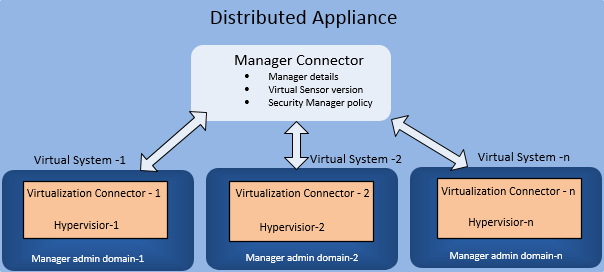

# Concepts
  
***

[REF:2.5] To configure OSC to act as a broker, you first define the building blocks. You then use these building blocks to configure OSC so that it can act as a broker between the virtualization provider and security solutions.

## Virtualization Connectors
In this building block, you define the virtualization provider entities. You must confirm that the virtualization provider is accessible to OSC.
* For VMware, you define the IP address and administrator logon credentials for NSX and vCenter.
* For OpenStack, you must make sure to define administrator credentials to Horizon, which is the OpenStack user-interface.

## Manager Connectors
In this building block, you define the management console for managing the security appliances. For IPS, you define the Manager IP address and the root admin logon credentials, which will manage the Virtual Sensors installed in the hosts. For firewall, you define the Security Management Console (SMC) IP address and the API authentication key.

## Appliance Instances
The virtual security appliances, which intercept the traffic from the VMs. For IPS, Virtual Sensors are the security appliance instances, which are referred to as Virtual Security System instances. For firewall, Virtual Layer 2 Firewalls are the security appliance instances, which are referred to as VSS Container Firewalls. 

## Security Services
This component refers to the security service you intend to deploy such as next-generation IPS or next-generation firewall. You can use the **Service Function Catalog** page to upload corresponding software images for further deployment through OSC.

## Distributed Appliances
A distributed appliance, associates the security solution and the virtualization solution. That is, you define a distributed appliance using the virtualization connectors and security manager connector as building blocks.  
In a distributed appliance, you specify the following:
* One security manager connector.
* The model and version of the security appliance.
For IPS, this is the version and model of the virtual Sensors, which are later deployed in the ESXi hosts. For firewall, this is the version of the VMware vCenter compatible image of:
* One or more virtualization connectors.
* For each virtualization connector, you must select a Manager admin domain. The security appliances are managed under the specified admin domain. In the case of IPS, if you select My Company (root admin domain), all virtual Sensors are managed under My Company in the Manager. In case of firewall, select shared domain in SMC to view the managed devices.

  
*Distributed Appliance and Virtual Systems*

## Deployment Specifications
A deployment specification empowers you to mobilize the objective of your service deployment strategy. Since every implementation varies from another, you can employ a strategy that best suits your requirements. In the meanwhile, OSC continually monitors the infrastructure to make sure that your objectives are implemented.  
Examples of what you can achieve through a deployment specification are:
* Deploy security services only on particular hosts or tenants.
* Provision more than one instance of a security service on a single host to load balance traffic.
* Designate a set of hypervisor to have many security instances so as to handle all traffic flowing to and from VMs to pass through that host.

## Virtual Systems
A virtualization connector associated with a manager domain is a virtual system.  
The most common example of a virtual system is the Virtual Security System for IPS and Virtual Security System container for firewall. A Virtual Security System is the logical container object for all deployed virtual security service functions or Virtual Security System instances.

## Agents
Security services deployed through OSC have the following agents.  
* Control Path Agent: This agent is responsible for communication between the security services and the security manager.
* Data Path Agent: This agent makes sure the traffic from the VMs are routed through the security service for inspection in case of VMware. The data path agent does not manage traffic for Openstack.

## Jobs and Tasks
Some of the actions that you perform in OSC are treated as jobs and tasks. The high-level action is treated as a job. For example, synchronizing a distributed appliance is a job. A job might consist of a number of tasks. That is, a job can be broken down into tasks. For example, if synchronizing a distributed appliance is the job, checking the manager connector and validating existing NSX components are some of the tasks. When all tasks are completed successfully, the corresponding job is complete.  
Jobs and tasks enable you to easily track and troubleshoot your actions in OSC. When you trigger a job, the state, status, start time, completed time, and so on are displayed for the job as well as its component tasks.  
Certain actions you perform in OSC are tracked as jobs. When you start a job, it triggers one or more background activities in OSC. These background activities are tracked as tasks of that job. Therefore, a job is completed only when all its tasks are successfully completed. Jobs and tasks enable easy tracking and troubleshooting. For example, if a job failed, you just have to look at the failed task to locate the stage at which the job failed. If a job is running for a long time, you can troubleshoot by looking at the task at which the processing is stuck.  
OSC triggers a job, when you take any of the following actions:
* Create, edit, synchronize, or delete a manager connector.
* Create, edit, synchronize, or delete a distributed appliance.
* Synchronize appliance instances.
* Appliance instance re-authentication.
* Upgrade the software for an appliance instance.
* Modify the password of the default users.

## Alarms, Alerts and Archives
You can now setup alarms that trigger alerts. The alarms can be set for different types of failures like job failures, system failure, or appliance instance failures. Different severity levels can be defined for each type of failure, and also add an email notification to be sent out in case of a failure. An alert is generated for every failure event that occurs. The description for the failure provides an easy way to troubleshoot the failure thereby reducing downtime. Alerts are generated with different severity level which depends on the severity level defined in the alarm. You can also acknowledge alerts that have been viewed so that you can filter alerts that require attention. You can archive older jobs and alerts. Tasks related to the jobs are also archived. You can either set an auto schedule to archive the jobs and alerts, or manually trigger archiving whenever required. There are different options by which you can set a schedule for archiving. You can also download the previous archived files for analysis.  
