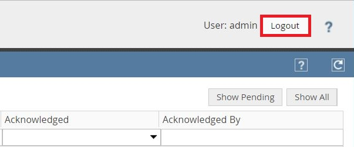

# Accessing OSC
After installing the OSC virtual appliance, it can be set up and managed using the [OSC web application](#accessing-the-osc-web-application) or accessed using the [OSC CLI](#accessing-osc-through-cli).

## Accessing the OSC Web Application
The OSC web application is used to set up and manage the OSC virtual appliance. It can also be used to configure the OSC virtual appliance for orchestrating a security service.

### Steps to Access the OSC Web Application
1. Open a supported browser, and then enter `https://<IP Address of OSC>` as the URL.
2. In the **Login ID** field, enter the username and corresponding password provided by your OSC administrator.
If you are accessing OSC after the initial setup, use the default username and password: `admin` and `admin123` respectively.  
  
*Logon Screen*
3. Click *Log In*.
4. To log out from the OSC web application, click **Logout** in the top-left corner of the screen.  
  
*OSC Logout*

	>If your OSC web application session is idle for 30 minutes, you are automatically logged out. This setting is not configurable.

## Accessing OSC through CLI
OSC can be accessed through the OSC CLI by using an SSH client.

### Steps to Access OSC through CLI
1. Open your preferred SSH client.
2. Enter the IP address of OSC with **22** as the port number.
3. Start the SSH session.
4. Enter the username and password of OSC when prompted.

See [CLI Commands](../references/cli.md) for all CLI commands.

