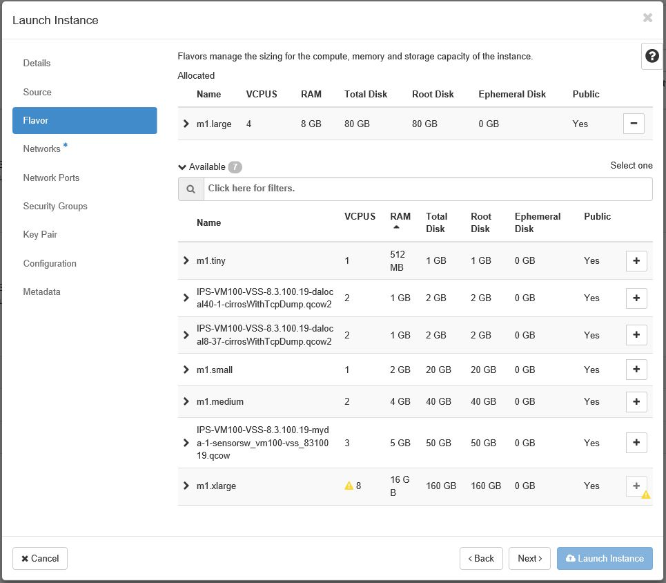
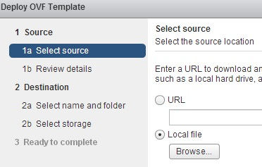
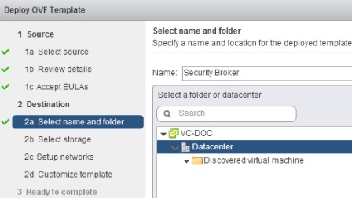
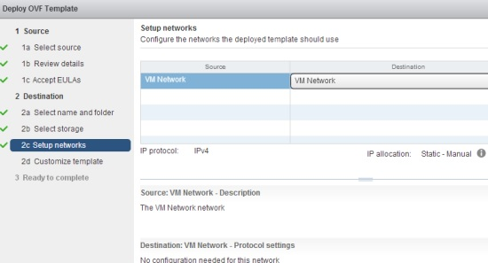
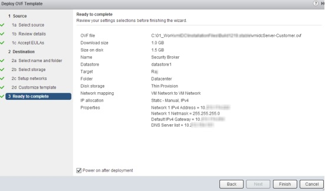
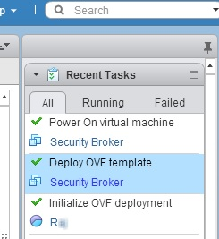

# Installing the OSC Virtual Appliance

OSC is a virtual appliance which you install on a hypervisor. Use the corresponding virtualization manager to install OSC. In the case of [installing on OpenStack](#steps-to-install-osc-in-an-openstack-environment), you would use the OpenStack dashboard and in the case of [installing on VMware](#steps-to-install-osc-in-a-vmware-environment), you would use the vSphere Web Client.

> Before you begin
> * You have necessary network settings for the OSC virtual appliance.
> 	* Remember only IPv4 addresses are supported.
> * The OSC image file is accessible from your client machine.

## Steps to Install OSC in an OpenStack Environment

1. Log on to OpenStack by entering the assigned OpenStack IP address as the URL in a browser and enter the username and password.
2. In the OpenStack dashboard menu, navigate to **Project** > **Compute** > **Images**.
3. Click the  button.
4. Enter a name, the source, and the format of the image. The image source must be the OSC QCOW image and the format of the image must be `QCOW2 - QEMU Emulator`. Additional fields can be specified if needed.  
  
*Importing an Image*
5. After the image is imported, navigate to **Project** > **Compute** > **Instances**.
6. Click the  button.
7. Enter an Instance Name and click **Next**.  
  
*Launch Instance - Details*
8. Find the image that was imported and click the  button to the right of the image and click **Next**.  
  
*Launch Instance - Source*
9. Choose the flavor `m1.large` to manage the compute size, memory, and storage capicity and click **Next**.  
  
*Launch Instance - Flavor*
10. Choose a network and click **Next**.  
  
*Launch Instance - Network*
11. If needed, continue with setup or click the  button.  
	* **Note**: If you want the OSC instance to be reachable from an external network, you can [associate floating IP addresses](https://docs.openstack.org/user-guide/cli-manage-ip-addresses.html "OpenStack Docs: Manage IP addresses").

## Steps to Install OSC in a VMware Environment

1. Log on to vCenter Server using the vSphere Web Client as the root user.
2. In the vSphere **Home** tab, select **Hosts and Clusters**.
3. Select the required node such as a resource pool, right-click, and select **Deploy OVF Template**.  
  
*Deploy OVF Template*
4. Click **Browse** and locate the .ova file.  
  
*Locate .ova File*  
If not done already, you might be prompted to install and allow access to the VMware Client
Integration Plug-In.
5. Review the details and click **Next**.
6. In the **Accept EULAs** window, click **Accept** and then **Next**.
7. Enter a relevant name for the OSC virtual appliance.
	* The name must be unique within a data center.
8. Select a folder or data center where to deploy OSC and click **Next**.  
  
*Select a Folder*
9. Select the required value from the **Select virtual disk format** drop-down list based on your requirement.
10. Select the required datastore and click **Next**.  
  
*Select the Datastore*
11. In the **Setup networks** section, select the required switch port group.
	* The switch port group must enable OSC to communicate to the related applications such as the Security Manager, vCenter, NSX, and virtual security appliances. You must also be able to access the [OSC web application](./accessing.md#accessing-the-osc-web-application) as well as the [OSC CLI](./accessing.md#accessing-osc-through-cli) from your client machine.  
  
*Setup Networks*
12. In the **Customize template** section, enter the network settings for the OSC appliance and click **Next**.
	* Enter an IPv4 address for the OSC virtual appliance. IPv6 is not supported currently.
	* Enter the subnet mask for the IP address.
	* Enter the default gateway IP address.
	* Enter the IPv4 addresses of DNS servers separated by a space. You can specify up to 2 DNS servers; that is, one primary and the other secondary DNS server.  
  
*Enter the IP Addresses*
13. Review the information displayed in the **Ready to Complete** section, select **Power on after deployment**, then click **Finish**.  
  
*Ready to Complete*  
To Make any changes, click **Back**.
14. In the **Recent Tasks** section, monitor the installation.  
  
*Recent Tasks*
15. Confirm successful installation by accessing the [CLI](./accessing.md#accessing-osc-through-cli) as well as the [web application](./accessing.md#accessing-the-osc-web-application).