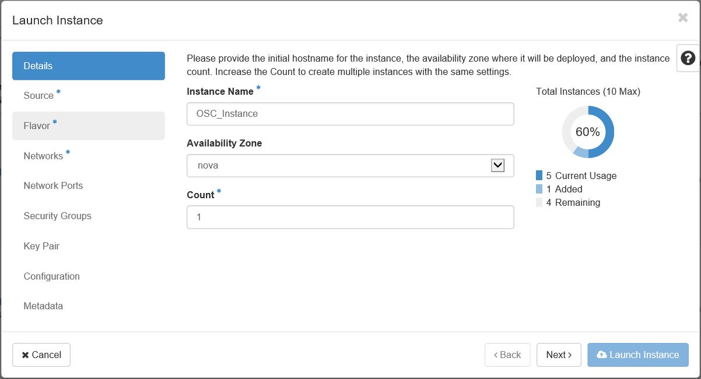

# Installing the OSC Virtual Appliance

OSC is a virtual appliance which you install on a hypervisor. Use the corresponding virtualization manager to install OSC. In the case of OpenStack, for example, you would use the OpenStack dashboard to install OSC.

> Before you begin
> * It is recommended that you use root administrator user privileges to install OSC.
> * You have necessary network settings for the OSC virtual appliance.
> 	* Remember only IPv4 addresses are supported.
> * The OSC image file is accessible from your client machine.

## Steps to Install OSC in an OpenStack Environment

1. Log on to OpenStack by entering the assigned OpenStack IP address as the URL in a browser and enter the username and password.
2. In the OpenStack dashboard menu, navigate to **Project** > **Compute** > **Images**.
3. Click the  button.
4. Enter a name, the source, and the format of the image. Additional fields can be specified if needed.  
  
*Importing an Image*
5. After the image is imported, navigate to **Project** > **Compute** > **Instances**.
6. Click the  button.
7. Enter an Instance Name and click **Next**.  
  
*Launch Instance - Details*
8. Find the image that was imported and click the  button to the right of the image and click **Next**.  
  
*Launch Instance - Source*
9. Choose a flavor to manage the compute size, memory, and storage capicity and click **Next**.  
  
*Launch Instance - Flavor*
10. Choose a network and click **Next**.  
  
*Launch Instance - Network*
11. If needed, continue with setup or click the  button.  
	* **Note**: If you want the OSC instance to be reachable from an external network, you can [associate floating IP addresses](https://docs.openstack.org/user-guide/cli-manage-ip-addresses.html "OpenStack Docs: Manage IP addresses).