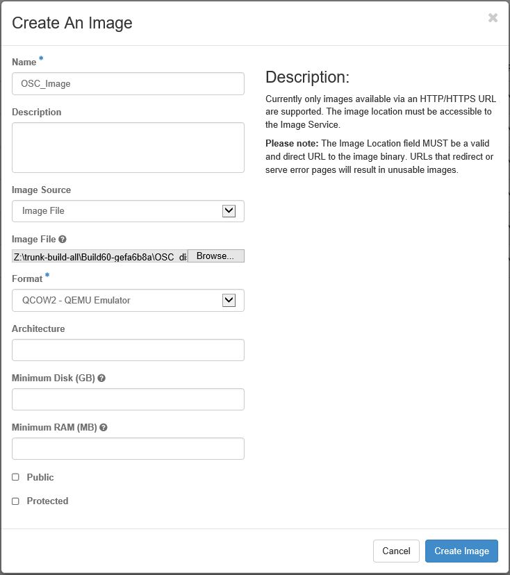
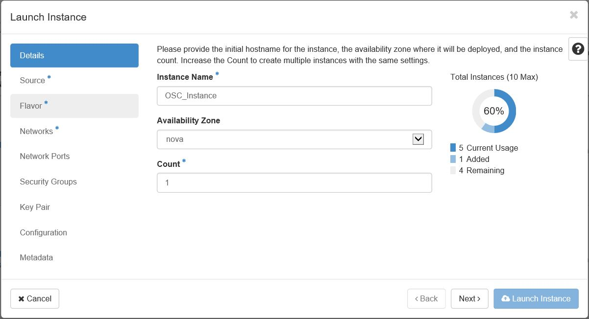
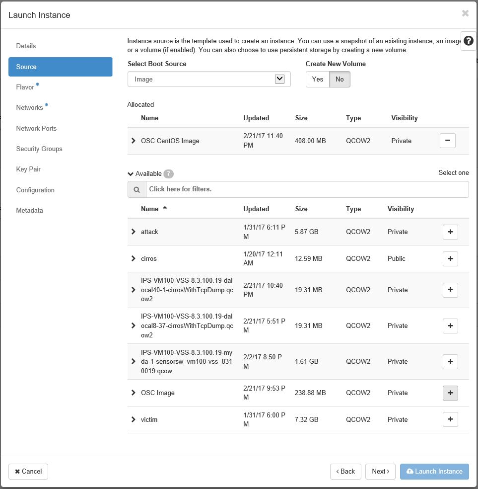
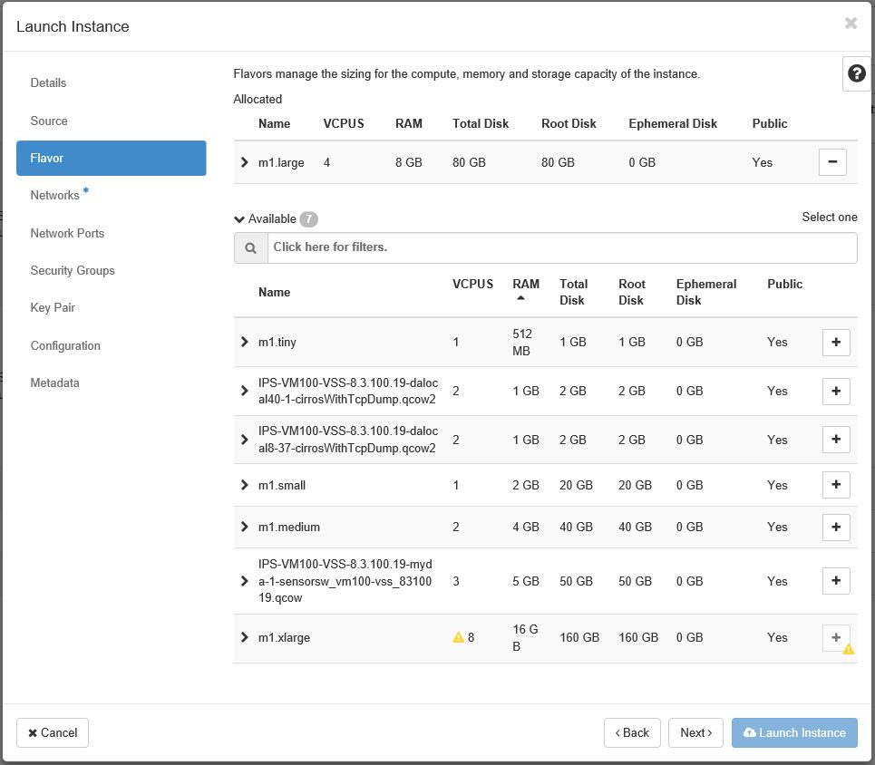
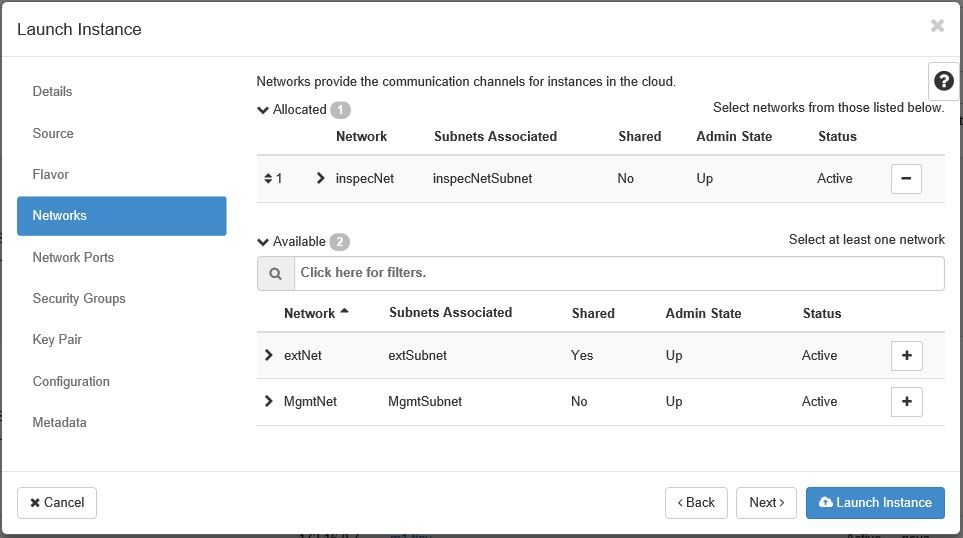

## Steps to Install OSC in an OpenStack Environment
Complete the following steps to successfully install OSC in an Openstack environment:

1. Log on to OpenStack by entering the assigned OpenStack IP address as the URL within a browser, and then enter the username and password.
2. In the OpenStack dashboard menu, navigate to **Project** > **Compute** > **Images**.
3. Click the  button.
4. Enter the name, source, and format of the image. The image source must be the OSC QCOW image. The format of the image must be `QCOW2 - QEMU Emulator`. Additional fields can be specified if needed.  
  
*Importing an Image*
5. Once the image is imported, navigate to **Project** > **Compute** > **Instances**.
6. Click the  button.
7. Enter an Instance Name, and then click **Next**.  
  
*Launch Instance - Details*
8. Locate the imported image, and then click the  button located to the right of the image. Click **Next**.  
  
*Launch Instance - Source*
9. Choose the flavor `m1.large` to manage the compute size, memory, and storage capacity, and then click **Next**.  
  
*Launch Instance - Flavor*
10. Choose a network, and then click **Next**.  
  
*Launch Instance - Network*
11. If needed, continue with setup or click the  button.  
	* **Note**: If you want the OSC instance to be reachable from an external network, you can [associate floating IP addresses](https://docs.openstack.org/user-guide/cli-manage-ip-addresses.html "OpenStack Docs: Manage IP addresses").
12. Confirm successful installation by accessing the [CLI](./accessing.md#accessing-osc-through-cli) as well as the [web application](./accessing.md#accessing-the-osc-web-application).
