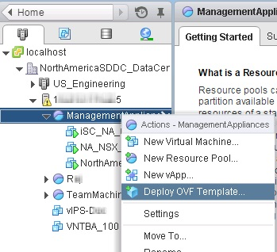
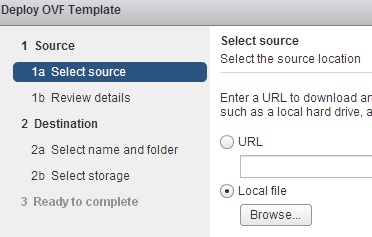
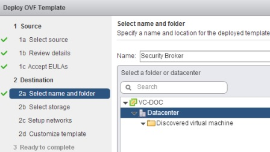
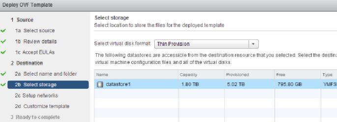
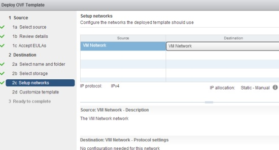
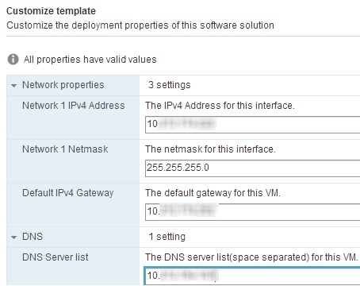
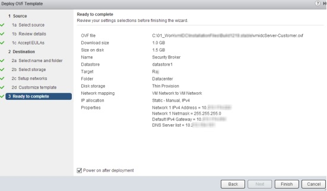
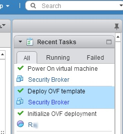

# Installing OSC in a VMware Environment
Complete the following steps to successfull install OSC in a VMWare environment:

1. Log on to vCenter Server using the vSphere Web Client as the root user.
2. In the vSphere **Home** tab, select **Hosts and Clusters**.
3. Select the required node such as a resource pool, then right-click, and select **Deploy OVF Template**.  
  
*Deploy OVF Template*
4. Click **Browse** and locate the .ova file.  
  
*Locate .ova File*  
You may be prompted to install and allow access to the VMware Client Integration Plug-In, if not already completed.
5. Review the details, and then click **Next**.
6. In the **Accept EULAs** window, click **Accept**. and then click **Next**.
7. Enter a relevant name for the OSC virtual appliance.
	>Note: The name must be unique within a data center.
8. Select a folder or data center of where to deploy OSC, and then click **Next**.  
  
*Select a Folder*
9. Select the required value from the **Select virtual disk format** drop-down list based on your requirement.
10. Select the required datastore, and then click **Next**.  
  
*Select the Datastore*
11. In the **Setup networks** section, select the required switch port group.
	* The switch port group must enable OSC to communicate to the related applications such as the Security Manager, vCenter, NSX, and virtual security appliances. You must also be able to access the [OSC web application](/gettingstarted/accessing.md#user-content-accessing-the-osc-web-application) as well as the [OSC CLI](/gettingstarted/accessing.md#user-content-accessing-osc-through-cli) from your client machine.  
  
*Setup Networks*
12. In the **Customize template** section, enter the network settings for the OSC appliance as shown below, and then click **Next**.
	* Enter an IPv4 address for the OSC virtual appliance. IPv6 is not currently supported.
	* Enter the subnet mask for the IP address.
	* Enter the default gateway IP address.
	* Enter the IPv4 addresses of DNS servers separated by a space. You can specify up to 2 DNS servers; one primary and the other secondary DNS server.  
  
*Enter the IP Addresses*
13. Review the information displayed in the **Ready to Complete** section, select **Power on after deployment**, and then click **Finish**.  
  
*Ready to Complete*  
To make any changes, click **Back**.
14. Monitor the installing in the **Recent Tasks** section.  
  
*Recent Tasks*
15. Confirm successful installation by accessing the [CLI](/gettingstarted/accessing.md#user-content-accessing-osc-through-cli) as well as the [web application](/gettingstarted/accessing.md#user-content-accessing-the-osc-web-application).
