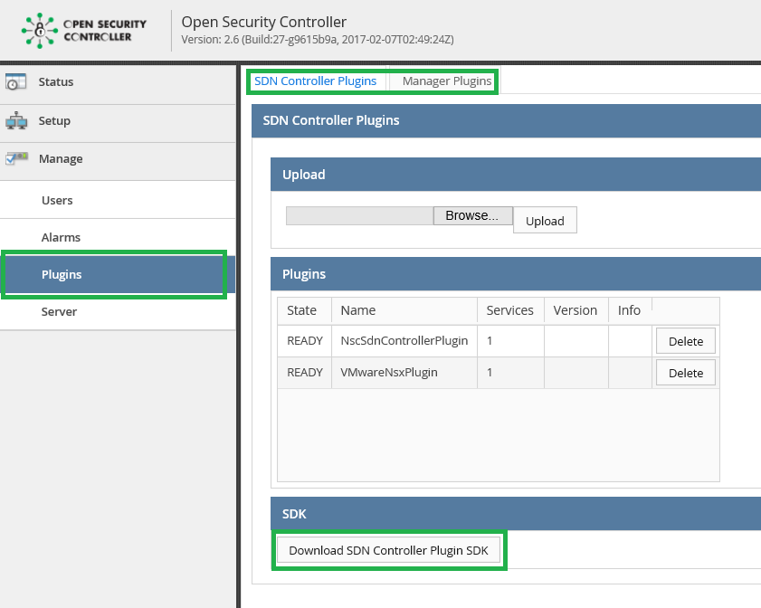

# OSC Plugins

The OSC plugin model allows integration with VNF security managers and the SDN layer of the virtualized environment.  OSC defines two distinct plugins: 

* Security Manager Plugin 
* SDN Controller Plugin

Both of these plugins are defined through a set of java interfaces that describe the functionality OSC expects from the plugins.  
Through this mechanism, OSC can invoke security managers or SDN controller APIs without knowing their details. The implemented plugins bridge the gap between specific APIs exposed by these external services and the interfaces/contract expected by OSC.  

## Plugins SDK
The first step towards developing OSC plugins is to download OSC dependencies containing the java interfaces that define the functionality of the plugins. We refer to these dependencies as the OSC Plugins SDK.  
You can download the SDKs directly from the OSC web UI:

1. Login to OSC web UI.
2. Navigate to Manage -> Plugins.
3. Download the plugin SDK:
	* For the SDN Controller Plugins SDK:  
		Select the **SDN Controller Plugins** tab.  
		Click **Download SDN Controller Plugin SDK**.
	* For the Security Manager Plugin SDK:  
	    Select the **Manager Plugins** tab.  
		Click **Download SDN Controller Plugin SDK**.

  
*OSC Plugins View*

## Building And Testing OSC Plugins
The OSC server uses OSGi technology to provide a dynamic plugin model. For details on how to build and test OSC plugins, see the **[Building OSC Plugins with OSGi](./osgi_plugin.md)** documentation.

## Plugins

* For more details on the OSC manager plugins, see the **[Security Manager Plugins](./security_mgr_plugin.md)** documentation.
* For more details on the OSC SDN controller plugins, see the **[SDN Controller Plugins](./sdn_controller_plugin.md)** documentation.
