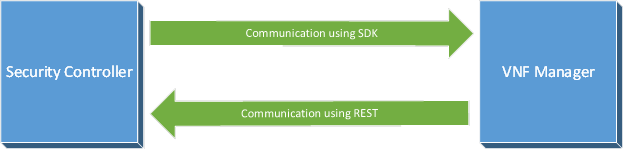
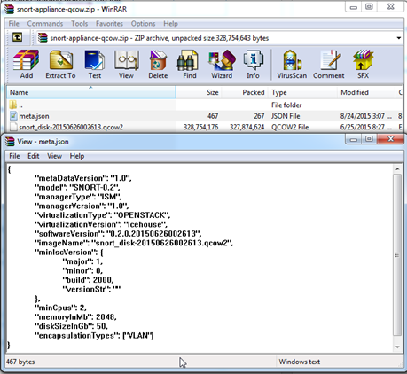

# VNF Security Managers
The OSC Manager Plugin SDK contains the set of APIs that define the functionality OSC expects from a VNF security manager.  
OSC communicates with the security manager through these interfaces to implement its orchestration and management capabilities.  
In addition to supporting manager plugins, OSC also exposes REST endpoints for managers to call back in order to send notifications and query information.  

  
*OSC and VNF Security Manager*

## Security Manager Plugin SDK

### Manager Information
This is the main entry point for all the interactions with the security manager. It provides a way for OSC to instantiate the other manager APIs and basic information like:
* The type of supported authentication.
* Manager console URL.
* Provided service name (NGFW, IPS, etc).
* Availability status of the manager.


### Notifications
* **Manager Notifications**

The notification APIs allow OSC to subscribe to receive notifications from the manager for any changes made by the customer on the manager. For example, if a policy was created/updated or if a new domain was added/modified etc.  
OSC supports the following subscription types:
 * Notifications over a web socket connection established by OSC.
 * Notifications using a callback URL which OSC can register.  

The plugin implementation can choose to use either of the mechanisms or choose to not implement any notification.

* **OSC Jobs Notification** 

OSC can also provide notifications to the manager for actions which the manager wants to track. OSC provides jobs and tasks notifications to the manager.  
For example, if the manager needs to propagate a signature file to some devices and wants to track the status of that action (job), then OSC would use the jobs notification APIs to inform the manager about the progress and success/failure of that job.

### Devices  
These APIs allow OSC to manage the devices on the VNF manager. The functionality provided by these API include:

* CRUD operations for device groups or containers.
* CRUD operations for devices.
* Check version validity for appliance upgrades or downgrades. 
* Retrieve device status.  
* Retrieve device bootstrap information. For more details see [Bootstrapping An Appliance](#bootsrapping-an-appliance)

### Policy Mapping
These set of APIs is used by OSC to perform CRUD operations on policy-tag(VLAN) mapping within the context of a device container.  This set of APIs is optional.  

### Security Groups
These APIs are used by OSC to propagate security group information and membership to the managers:
* Create, update and delete security groups.
* Update security group members.  

This set of APIs is optional. 

### Domains
These APIs are used by OSC to retrieve domain information provided by the managers.  This set of APIs is optional. 

### Policies
These APIs are used by OSC to retrieve policy information provided by the managers.  This set of APIs is optional. 

### Plugin Properties
In addition to the functionalities mentioned above, this SDK also specificies a set of required properties that must be provided when [registering the plugin implementation as an OSGi service](osgi_plugin.md#exposing-the-service-provided-by-the-plugin). These properties will be used by OSC to identify and correctly use the plugin.  For more details and the full list of required properties, see the `javadoc` of the interface `org.osc.sdk.manager.api.ApplianceManagerApi` defined by this SDK.

## OSC Manager Callback REST APIs

The authentication mode supported by all the APIs below is `Basic Auth` and the content type is `application/json`. TODO: application/xml as well?

### Notification API
Notifies OSC about registered changes in the manager.  The relevant manager connector is derived from the IP address of the HTTP client originating the request.

**POST** `/api/manager/v1/notification`

**Request**

| Name   | Located In |  Required | Description | Default | Schema |  
|--------|--------|-----------------|----------|----------|---------|
|body        | body       | yes| | | Notification|

**Notification**

| Name   |Type |  Required | Description |
|--------|--------|-----------------|----------|
|eventNotification | EventNotification  | No | - |

**EventNotification**

| Name   |Type |  Required | Description |
|--------|--------|-----------------|----------|
|eventObject | string  | Yes | Notification object identifier. This will be used when OSC makes calls through the manager plugin. |
|eventType | string| Yes | Notification object type. This will be used when OSC makes calls through the manager plugin. | 

**Response**

| Status Code   |Reason |  Response Model |
|--------|--------|-----------------|
|200 | Success  | BaseJobResponse |
|400 | Failure | ErrorCodeDto |

### VM Information API
Allows the manager to retrieve virtual machine information using the VM UUID, IP address, MAC address or the Flow 6-field-tuple. The request may include multiple search criteria. The response will contain a map between the VM information found and the respective value of the search criteria.  

**POST** `/api/manager/v1/queryVmInfo`

**Request**

| Name   | Located In |  Required | Description | Default | Schema |  
|--------|--------|-----------------|----------|----------|---------|
|body        | body       | yes| | | QueryVmInfoRequest |

**QueryVmInfoRequest**
Contains a list of IP and/or MAC and/or VM-UUID and/or a map of unique-request-identifier key and flow value.


| Name   |Type |  Required | Description |
|--------|--------|-----------------|----------|
|applianceInstanceName | string  | No | The name of the appliance corresponding to the targeted VM |
|ipAddress | string[]  | No | The list of IP addresses for which VM information is queried |
|macAddress | string[]  | No | The list of MAC addresses for which VM information is queried |
|vmUuid | string[]  | No | The list of VM UUIDs for which VM information is queried |
|flow | object  | No | A map of a string key (must be unique) and **FlowInfo** (5-tuple + timestamp) value for which VM information is queried. The **FlowInfo** structure comprises: sourceIpAddress, sourcePort, destinationIpAddress, destinationPort, protocolId and flowTimestamp |

**Response**

| Status Code   |Reason |  Response Model |
|--------|--------|-----------------|
|200 | Success  | QueryVmInfoResponse |
|400 | Failure | ErrorCodeDto |

**QueryVmInfoResponse**
Contains a map of key/values. The key can be IP address, MAC address, VM UUID or a unique-request-identifier in case of flow based query.  


| Name   |Type |  Required | Description |
|--------|--------|-----------------|----------|
|vmInfo | object  | No | A map containing the query identifier key (IP, MAC, VM UUID) and the value holding the VM info |
|flowVmInfo | object | No | A map containing a flow based request unique identifier key and the value holding the VM info |

## Bootsrapping An Appliance
As part of deployment of the VNF, OSC provides some bootstrapping information to the appliance so it can start up and communicate with its manager.
This is achieved by using the [configuration drive](http://docs.openstack.org/user-guide/cli_config_drive.html) functionality provided by OpenStack. The config drive attaches to the instance when it boots. The instance can mount this drive and read files from it to get information that is normally available through the metadata service.  
It is intended to provide a minimal amount of launch-time personalization. The max size of the file contents is 10KB.
OSC allows you to specify a list of multiple files each with their own name and content. 
For instance, /<MOUNT_POINT>/openstack/content/0000 will contain the first file content as a base64 encoded string which when decoded will have the following information in a key value format: 
```
managerIp=X.X.X.X
managerUser=agent
managerPassword=XXXXXX
virtualSystemId=353
applianceName=IPS-353-257
```
The above is just a sample. The manger should be able to provide us with any information which it expects to be present in the seed file so it can initialize itself and be able to contact its manager.  

## Packaging An Appliance
In order for appliance images to be imported in OSC they must be packaged as a *zip* file along with a descriptor file containing information in `json' format:  

  
*Packaging an Appliance Image For OpenStack*

### OSC Appliance Image Metadata
The file `meta.json` must be in the root of the folder structure inside the zip file (see image above) and it must contain:

**Model:**  The Model/Name of the device to be displayed on the OSC UI.  
**Manager Type:**  This should match plugin name. 
**Manager Version:**  Version of the manager the appliance is compatible with.  
**Virtualization Type:** *OPENSTACK* or *VMWARE*.  
**Virtualization Version:** The version of the virtualization platform the appliance is compatible with.  
**Appliance Version:** The version of the appliance to be displayed on the OSC UI.  
**Appliance Image Name:** The file name of the appliance image inside of the .zip file. 
**OSC Version:** The minimum OSC version that supports this appliance.  
**CPU, Memory and Disk:** The resources required by the appliance.  
**Encapsulation Type:** The type of encapsulation to use to provide policy mapping data.  
**Additional Inspection NIC:** *True* indicates that the appliance needs separate ingress and egress inspection ports as opposed to a single inspection port which handles both ingress and egress traffic.  
**Image Properties:** Key-value pairs of properties to be consumed by the virtualization environment, i.e.: OpenStack image properties like `hw_disk_bus`.  
**Configuration Properties:** Key-value pairs of properties used to provide information to the device during bootstrapping.  

Below is an example of a json containing this information:

```json
{
	"metaDataVersion": "1.1",
	"model": "IPS-VM100-VSS",
	"managerType": "ISM",
	"managerVersion": "1.0",
	"virtualizationType": "OPENSTACK",
	"virtualizationVersion": "Icehouse",
	"softwareVersion": "0.2",
	"imageName": "snort_disk-20150626002613.qcow2",
	"minIscVersion": {
		"major": 2,
		"minor": 5,
		"build": 3651,
		"versionStr": ""
	},
	"minCpus": 4,
	"memoryInMb": 6144,
	"diskSizeInGb": 50,
	"encapsulationTypes": ["VLAN"],
"additionalNicForInspection": true,
	"imageProperties": {
		"hw_disk_bus": "ide"
	},
	"configProperties": {
		"applianceModel": "IPS-VM100-VSS",
		"applianceSoftwareVersion": "0.2"
	}
}
```


