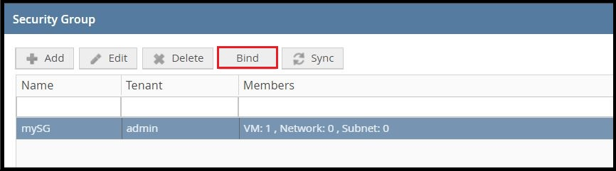

# Tutorial: Protecting Assets with OSC on OpenStack

Given an existing [OpenStack compatible environment](../gettingstarted/requirements.md#openstack) and a [deployed instance of OSC](../gettingstarted/installing_ost.md), this tutorial provides the necessary steps of setting up OSC to protect a single workload instance in OpenStack. 

These steps include: 
* deployment of a security appliance instance
* definition of the workload under protection
* redirection of the traffic to be protected through the security appliance

## Setup Requirements

### Virtualization Environment  

* In OpenStack, [create a tenant and domain](https://docs.openstack.org/mitaka/install-guide-obs/keystone-users.html). This tutorial refers to the tenant as `TENANT`, with the value "admin". The domain is referred to as `REGION`, with the value "RegionOne".
* In OpenStack, create two virtual machines in the `TENANT` and `REGION`. These virtual machines are hereby referred as the `ATTACKER` and the `VICTIM`.

### Networks and Connectivity  
#### Minimum Network Requirements  
For OSC to function successfully, the following minimum network requirements must be met: 

* Both the `ATTACKER` and `VICTIM` must be able to communicate to each other through HTTP.  
* Must contain two unique networks:  
 * One **Management Network** primarily for communication between the security manager and the **Distributed Appliance Instance**.  
   > **Note**: If the security manager is externally hosted, both a router and an external network are needed for the security manager to communicate to the **Distributed Appliance Instance**. The network should be configured as **shared** and **external**. 
 * One **Inspection Network** for which redirected traffic will be intercepted.  

S#### Tutorial Network Topology
For this tutorial, the network topology in OpenStack should be as follows:  

* `MANAGEMENT NETWORK`: The **Management Network** will be overloaded with the deployment of the `ATTACKER` and `VICTIM`, and used for communication between both the `ATTACKER` and `VICTIM`, the *internal* security manager, and the **Distributed Appliance Instance**. Its configurations consist of one port for the `ATTACKER`, one for the `VICTIM`, and one for the **Distributed Appliance Instance**. 
* `INSPECTION NETWORK`: This network will be used for intercepting traffic sent from the `ATTACKER` to the `VICTIM`. Its configurations consist of one port for the `MANAGEMENT NETWORK`, and one port for the **Distributed Appliance Instance**.

  
*Network Topology in OpenStack*  

### Security Appliance and Manager  
There are two options for obtaining a security appliance image and its corresponding manager plugin. The first option is to use an appliance image and manager plugin provided by a security manager vendor compatible with OSC. The second option is to manually create them. 

For this tutorial, it is assumed that the appliance image and security plugin will be manually created:  

* The [`SAMPLE MANAGER PLUGIN`](https://github.com/opensecuritycontroller/security-mgr-sample-plugin) is a dummy plugin that is available along with OSC. 
* The `SAMPLE APPLIANCE IMAGE` is a [manually packaged](../plugins/security_mgr_plugin.md/#packaging-an-appliance) [CirrOS image](http://download.cirros-cloud.net/). 
 * Use the following meta.json file data when packaging the appliance image: 
```json
{
	"metaDataVersion": "1.0",
	"model": "CIRROS-TCPD",
	"managerType": "ISM",
	"managerVersion": "1.0",
	"virtualizationType": "OPENSTACK",
	"virtualizationVersion": "Icehouse",
	"softwareVersion": "0.3.0.5000",
	"imageName": "cirrosWithTcpDump.qcow2",
	"minIscVersion": {
		"major": 0,
		"minor": 0,
		"build": 1,
		"versionStr": ""
	},
	"minCpus": 2,
	"memoryInMb": 1024,
	"diskSizeInGb": 2,
	"encapsulationTypes": ["VLAN"],
	"additionalNicForInspection": false
}
```

### SDN Controller  
OSC requires two components to implement traffic redirection and SDN notifications through an SDN controller. There are two options for obtaining these components: 
* the SDN controller plugin and,
* the corresponding SDN component. 
The first option is to use an SDN component and SDN controller plugin provided by an SDN controller vendor compatible with OSC. The second option is to manually create them.  

For this tutorial, it is assumed that the SDN component and SDN controller plugin will be manually created:  
 
* The [`SDN CONTROLLER NSC PLUGIN`](https://github.com/opensecuritycontroller/opensecuritycontroller.org/blob/master/plugins/plugins.md) is uploaded on OSC, enabling communication between the SDN controller and OSC.
* The **SDN Component** which is deployed on OpenStack for NSC.
  * TODO: add deployment steps

## Setting up OSC to Protect a Workload

### 1. Upload Plugin
In OSC, use the left-hand menu to navigate to **Manage** > **Plugins**. 
* Select the **SDN Controller Plugins** tab and upload the `SDN CONTROLLER NSC PLUGIN`.  
* Select the **Manager Plugins** tab and upload the `SAMPLE MANAGER PLUGIN`.  

  
*Upload SDN Controller and Manager Plugins*

### 2. Define Virtualization Connector  
Use the left-hand menu to navigate to **Setup** > **Virtualization Connectors** and select **Add**.
* Enter a name and select **OPENSTACK** as the type.
* For the SDN Controller, select **NSC** (Network Security Controller) as the type.
* For the Keystone:
	* Give the IP address of the `TENANT` environment in OpenStack.
	* Enter `admin` as the Admin Tenant Name.
	* Enter the OpenStack administrator credentials.

  
*Add Virtualization Connector*

### 3. Define Manager Connector  
Use the left-hand menu to navigate to **Setup** > **Manager Connectors** and select **Add**.
* Enter a name.
* For the type, select "**ISM**" as described by the `SAMPLE APPLIANCE IMAGE` and the `SAMPLE MANAGER PLUGIN`.
* Enter the IP address, `1.1.1.1`, and the credentials, `abc / 123`.
 * **Note**: When using a real security manager, use the real IP address and credentials.

  
*Add Manager Connector*  

After adding the manager connector, ensure that the **Last Job Status** is **PASSED** and that policies defined in the security manager are populated under **Polices** on the bottom-half of the page.

### 4. Define Service Function  
Use the left-hand menu to navigate to **Setup** > **Service Function Catalog** and select **Auto Import**.
* Browse to the `SAMPLE APPLIANCE IMAGE` and click **OK** to begin uploading the file.

### 5. Define Distributed Appliance  
Use the left-hand menu to navigate to **Setup** > **Distributed Appliance**. Under **Distributed Appliances**, select **Add**.
* Enter a name.
* For the manager connector, choose the **manager connector** that was previously created.
* Choose the `SAMPLE APPLIANCE IMAGE` that was imported in the security function catalog.
* Select the box, **Enabled**.
* Use the dropdown menu to select **VLAN** as the **Encapsulation Type**.  

  
*Add Distributed Appliance*

### 6. Define Deployment Specification  
Under the same menu, **Setup** > **Distributed Appliance**, select **Deployments** under **Virtual Systems** then select **Add**.  
* Enter a name.
* Select the OpenStack `TENANT`.
* Select the OpenStack `REGION`.
* Select **By Host** for the **Selection Criterion** and check the **Enabled** box.
* Select the `MANAGEMENT NETWORK` and the `INSPECTION NETWORK`. Do not select a floating IP pool unless you are using an external network with an external security manager.  

  
*Add Deployment Specification*  

After creating a deployment specification, ensure that the **Last Job Status** is **PASSED**.

### 7. Define Security Group  
Use the left-hand menu to navigate to **Setup** > **Virtualization Connectors**, select the virtualization connector that was created, and select **Add** on the lower half of the page under **Security Group**.  
* Enter a name.
* Select the `TENANT`.
* Select the `REGION`.
* Select **By Type** and **VM** for the **Selection Type**.
* Observe both virtual machines deployed on OpenStack on the left and select the `VICTIM`. `VICTIM` should be on the right after selection. 

  
*Add Security Group*  

### 8. Bind Security Group  
Under the same menu, **Setup** > **Virtualization Connectors**, select the security group that was just created and select **Bind**.  

  
*Select Security Group*  

* Check the **Enabled** box.
* Choose an **Inspection Policy** from the dropdown menu.  

  
*Bind Policy to Security Group*  

After binding, ensure that the **Last Job Status** is **PASSED**.

## Validating Setup and Redirection  

#### OpenStack Instances  
After setting up OSC and deploying a **Distributed Appliance Instance**, we can verify the **Distributed Appliance Instance** was deployed on OpenStack.  
* Log in to OpenStack and navigate to **Project** > **Compute** > **Instances**.  
* Observe that the **Distributed Appliance Instance** is listed as an instance in addition to the `ATTACKER` and `VICTIM`. Ensure the **Distributed Appliance Instance** image name reflects previous naming actions taken such as the name of the **Distributed Appliance Instance** (myDA) and the name of the image uploaded in the **Service Function Catalog**.  

  
*OpenStack Instances*  

#### Validating Network Redirection
In the case of using the dummy CirrOS image, when a policy is bound to a security group, no virtual machine can communicate to the protected virtual machine - the `VICTIM` - and any network traffic directed to the `VICTIM` will be intercepted by the **Distributed Appliance Instance** on the `INSPECTION NETWORK`. This is the expected behavior for the CirrOS image which implements a dummy behavior that always blocks traffic to the protected virtual machines. Let's take a look at the network traffic flow observed through the **Distributed Appliance Instance** when the security group is bound and when it is not bound.

* On OSC, ensure that the security group is [bound](#8.-bind-security-group).
* In the **Overview** tab for the `VICTIM`, note the `MANAGEMENT NETWORK` IP address. The `ATTACKER` will attempt to send an HTTP request to this address.  
* * On OpenStack, navigate to **Project** > **Compute** > **Instances** and open the `ATTACKER` and **Distributed Appliance** instances in different browser tabs and ensure the `VICTIM` is powered on.  
* Switch to the **Console** view for both the `ATTACKER` and **Distributed Appliance** instances.  
* From the `ATTACKER` console, send an HTTP request to the `VICTIM`, for example, use the command: `wget <VICTIM IP ADDRESS>`. Note that there should be no connection.  
* From the **Distributed Appliance** console:  
	* From the command line, enter `sudo ip link set eth1 up`.  
	* Enter `sudo tcpdump -i eth1`.
	* Observe the *redirected* packets coming from the `ATTACKER` IP address on the eth1 interface. This means the binding was a success.
* Unbind the security group on OSC by unchecking the **Enabled** checkbox.  

  
*Unbind the Policy from the Security Group*  

* From the `ATTACKER` console on OpenStack, send another HTTP request to the `VICTIM`.
	* The HTTP request should be successful now that the security group is unbound.
* From the **Distributed Appliance Instance**, there should be no redirected traffic from the `ATTACKER`.
