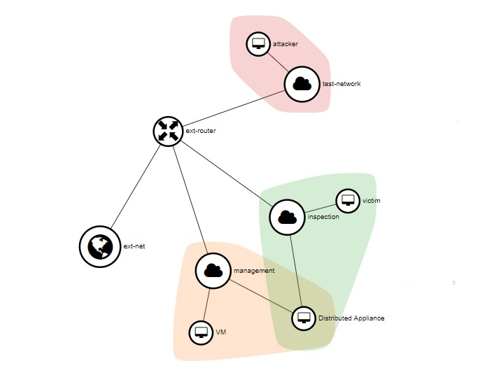
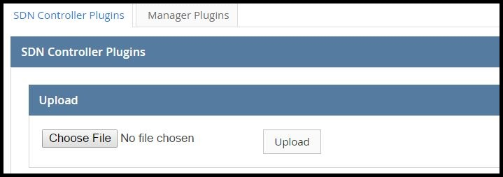
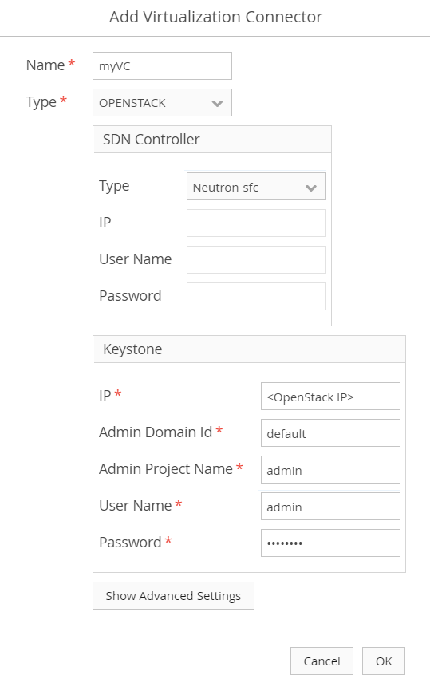
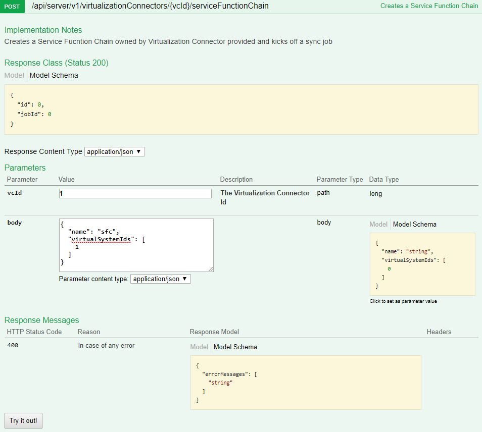
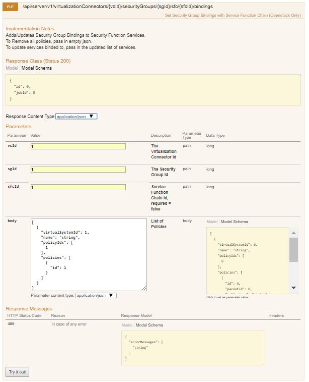
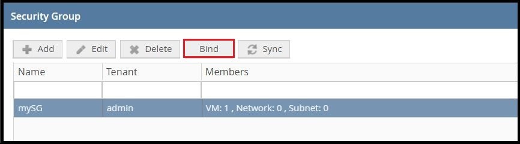
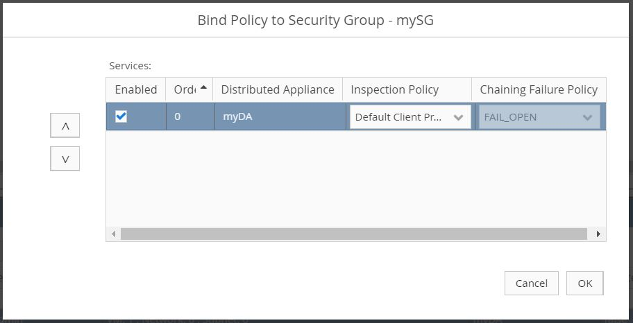
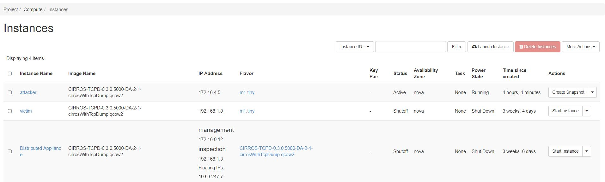
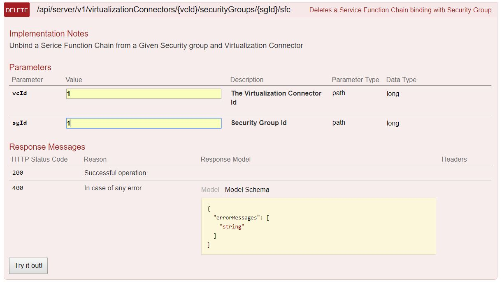
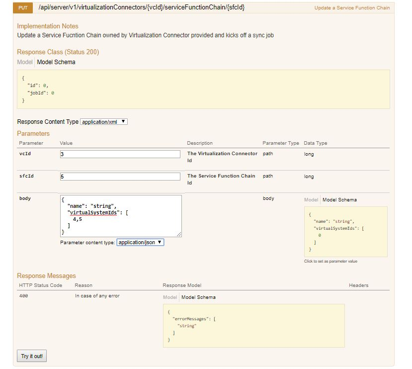

# Tutorial: Protecting Assets with OSC on OpenStack using Neutron SFC

Given an existing [OpenStack compatible environment](/gettingstarted/requirements.md#user-content-openstack) and a [deployed instance of OSC](/gettingstarted/installing_ost.md), this tutorial provides the necessary steps for setting up OSC to protect a single workload instance in OpenStack using Neutron Service Function Chain. 

These steps include: 
* Deployment of a security appliance instance.
* Definition of the workload under protection.
* Redirection of the traffic to be protected through the security appliance.

## Setup Requirements

### Virtualization Environment  

* In OpenStack, [create a tenant and domain](https://docs.openstack.org/mitaka/install-guide-obs/keystone-users.html). This tutorial refers to the tenant as `TENANT`, with the value "admin". The domain is referred to as `REGION`, with the value "RegionOne".
* In OpenStack, create two virtual machines in the `TENANT` and `REGION`. These virtual machines are hereby referred as the `ATTACKER` and the `VICTIM`.

### Networks and Connectivity  

#### Minimum Network Requirements  

For OSC to function successfully, the following minimum network requirements must be met: 

* Both the `ATTACKER` and `VICTIM` must be able to communicate to each other through HTTP.  
* Must contain following networks:  
 * One **Management Network** primarily for communication between the security manager and the **Distributed Appliance Instance**.  
   > Note: If the security manager is externally hosted, both a router and an external network are needed for the security manager to communicate to the **Distributed Appliance Instance**. The network should be configured as **shared** and **external**. 
 * One **Inspection Network** for which redirected traffic will be intercepted. All the virtual machines which need to protected should be connected through this network 
 * One **Test Network** where the attacker should be connected. 

#### Tutorial Network Topology

For this tutorial, the network topology in OpenStack should be as follows:  

* `MANAGEMENT NETWORK`: This network corresponds to the **Management Network** mentioned above. 
* `INSPECTION NETWORK`: This network will be used for intercepting traffic sent from the `ATTACKER` to the `VICTIM`. Its configurations consist of one port for the `MANAGEMENT NETWORK`, and one port for the **Distributed Appliance Instance**.
* `TEST NETWORK`: This can be any other network or external network where traffic sent from `ATTACKER` to any Virtual machine in the inspection network can be intercepted.

  
*Network Topology in OpenStack*  

### Security Appliance and Manager  

There are two options for obtaining a security appliance image and its corresponding manager plugin. The first option is to use an appliance image and manager plugin provided by a security manager vendor compatible with OSC. The second option is to manually create them. 

For this tutorial, it is assumed that the appliance image and security plugin will be manually created:  

* The [`SAMPLE MANAGER PLUGIN`](https://github.com/opensecuritycontroller/security-mgr-sample-plugin) is a dummy plugin that is available along with OSC. 
* The `SAMPLE APPLIANCE IMAGE` is a [CirrOS image](http://download.cirros-cloud.net/) that is [manually packaged](/plugins/security_mgr_plugin.md/#user-content-packaging-an-appliance). 
 * Use the following meta.json file data when packaging the appliance image: 
```json
{
	"metaDataVersion": "1.0",
	"model": "CIRROS-TCPD",
	"managerType": "ISM",
	"managerVersion": "1.0",
	"virtualizationType": "OPENSTACK",
 	"virtualizationVersion": "Icehouse",
	"softwareVersion": "0.3.0.5000",
	"imageName": "cirrosWithTcpDump.qcow2",
	"minIscVersion": {
		"major": 0,
		"minor": 0,
		"build": 1,
		"versionStr": ""
	},
	"minCpus": 2,
	"memoryInMb": 1024,
	"diskSizeInGb": 2,
	"encapsulationTypes": ["VLAN"],
	"additionalNicForInspection": false
}
```

### SDN Controller  

OSC requires two components to implement traffic redirection and SDN notifications through an SDN controller, an SDN component and an SDN controller plugin.

For this tutorial, it is assumed that the SDN component and SDN controller plugin will be manually created:  
 
* The [`SDN CONTROLLER NSFC PLUGIN`](/plugins/plugins.md) is uploaded on OSC, enabling communication between the SDN controller and OSC.
* The **SDN Component** deployed on OpenStack is Neutron Service Function Chain


## Set up OSC to Protect a Workload

### 1. Upload Plugin

Within OSC, navigate to **Manage** > **Plugins** using the left-hand menu. 
* Upload the `SDN CONTROLLER NSFC PLUGIN`.  
* Upload the `SAMPLE MANAGER PLUGIN`.  

  
*Upload SDN Controller and Manager Plugins*

### 2. Define Virtualization Connector  

Using the left-hand menu, navigate to **Setup** > **Virtualization Connectors**, and then select **Add**.
* Enter a name and then select **OPENSTACK** as the type.
* Select **NSFC** (Network Service Function Chain Controller) as the type for the SDN Controller.
* For the Keystone:
	* Give the IP address of the `TENANT` environment in OpenStack.
	* Enter `admin` as the Admin Tenant Name.
	* Enter the OpenStack administrator credentials.

  
*Add Virtualization Connector*

### 3. [Define Manager Connector](openstack_workload.md#3-define-manager-connector) 
### 4. [Define Service Function](openstack_workload.md#4-define-service-function) 
### 5. [Define Distributed Appliance](openstack_workload.md#5-define-distributed-appliance) 
### 6. [Define Deployment Specification](openstack_workload.md#6-define-deployment-specification) 
### 7. [Define Security Group](openstack_workload.md#7-define-security-group) 

### 8. Define a Service Function Chain
At present we can create a service function only through REST APIs, there is no support in OSC UI for defining SFC.
The OSC REST APIs provides all features as provided by OSC UI.
We can access OSC REST APIs through WEB interface with URL as https://<OSC-IP>:8090/api-doc/

Create a SFC as below
* Click on `Operations for Virtualization Connector` link
* Select  Parameter Content Type as `application/json`
* Enter the value for VirtualizationConnector Id 
* Enter the json body as below. Use model schema at right side as reference 

  
*Create Service Function Chain* 

* To get the virtual system ids use get API call from Distributed Appliance API
* Click on Try it out
* Ensure you get successful response with sfc Id


### 9. Bind Security Group  

At present binding to security group is supported only through REST APIs.
* For binding security group you need following parameters: virtualization connector id(vcId), security group id(sgId),
service function chain id(sfcId) and enter the json content in body using model schema as reference
* Select  Parameter Content Type as `application/json`
  
*Bind SFC to Security Group*
* Ensure you get response with status 200
* In OSC UI After binding, ensure that the **Last Job Status** is **PASSED**.

To ensure succeful binding navigate to **Setup** > **Virtualization Connectors**, then select the newly created security group. Select **Bind**.  

  
*Select Security Group*  

* Verify the checkbox is **Enabled**.

  
*Verify Binding*  


## Validating Setup and Redirection  

#### OpenStack Instances  

After setting up OSC and deploying a **Distributed Appliance Instance**, verify the **Distributed Appliance Instance** was deployed on OpenStack.  
* Log in to OpenStack and navigate to **Project** > **Compute** > **Instances**.  
* Observe that the **Distributed Appliance Instance** is listed as an instance in addition to the `ATTACKER` and `VICTIM`. Ensure the **Distributed Appliance Instance** image name reflects previous naming actions taken such as the name of the **Distributed Appliance Instance** (myDA) and the name of the image uploaded in the **Service Function Catalog**.  

  
*OpenStack Instances*  

#### Validating Network Redirection

In the case of using the dummy CirrOS image, when a policy is bound to a security group, no virtual machine can communicate to the protected virtual machine - the `VICTIM` - and any network traffic directed to the `VICTIM` will be intercepted by the **Distributed Appliance Instance** on the `INSPECTION NETWORK`. This is the expected behavior for the CirrOS image which implements a dummy behavior that always blocks traffic to the protected virtual machines. Let's take a look at the network traffic flow observed through the **Distributed Appliance Instance** when the security group is bound and when it is unbound.

* On OSC, ensure that the security group is [bound](#user-content-8-bind-security-group).
* In the **Overview** tab for the `VICTIM`, note the `INSPECTION NETWORK` IP address. The `ATTACKER` will attempt to send an HTTP request to this address.  
* On OpenStack, navigate to **Project** > **Compute** > **Instances**, and then open the `ATTACKER` and **Distributed Appliance** instances in different browser tabs. Ensure the `VICTIM` is powered on.  
* Switch to the **Console** view for both the `ATTACKER` and **Distributed Appliance** instances.  
* From the `ATTACKER` console, send an HTTP request to the `VICTIM`. For example, use the command: `wget <VICTIM IP ADDRESS>`. Note that there should be no connection.  
* From the **Distributed Appliance** console:  
	* From the command line, enter `sudo ip link set eth1 up`.  
	* Enter `sudo tcpdump -i eth1`.
	* Observe the *redirected* packets coming from the `ATTACKER` IP address on the eth1 interface. This means the binding was a success.
* Unbind the security group from OSC REST API for delete binding sfc with security group.  
* Ensure you get response with status code 200.  

  
*Unbind the Policy from the Security Group*  

* From the `ATTACKER` console on OpenStack, send another HTTP request to the `VICTIM`.
	* The HTTP request should be successful now that the security group is unbound.
* From the **Distributed Appliance Instance**, there should be no redirected traffic from the `ATTACKER`.

## Creating Chain of services.
For creating chain of services, more than one Distributed Appliance need to be created. A service function chain can have multiple distributed appliances which are chained together. The service function chain can have one or more distributed appliances each having different security appliance. 
Steps to create chain of services
#### 1. Import different security appliance image, refer step 4 from the tutorial for [protecting openstack workloads](openstack_workload.md)
#### 2. Create another DA and DS refer steps 5 and 6 from the tutorial for [protecting openstack workloads](openstack_workload.md)
#### 3. Update Service Function Chain using REST API by adding virtual system id of newly created Distributed Appliance
  
 *Update API for SFC*  
* To get virtual system id's use GET API for Distributed appliance.  
* The order of virtual system ids in json body determines the order of service functions in sfc  

#### 4. Update the binding of security group with sfc. 
* Refer step 9 described above for updating the sfc binding with sg.
* Need to pass multiple virtual systems information in the json body as a list. Each Virtual system should include of one or more policy ids of the policies that it supports. 
