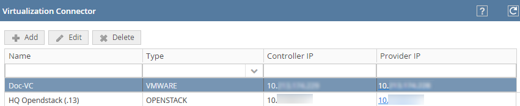
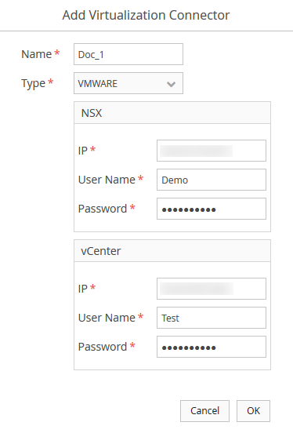
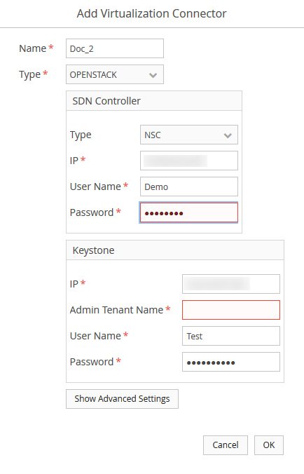

## Define Virtualization Connectors

> **Before you Begin**
To add a virtualization connector, you must have already uploaded the SDN controller plugins based on your virtualization environments.

You are able to define virtualization connectors from the OSC web application. **TODO: This does not make sense**

### Task
1. In the OSC web application, select **Setup | Virtualization Connectors**.
The **Virtualization Connector** page displays the currently available virtualization connectors.

*Virtualization Connector Page*
*Option definitions*<table><thead align="left" class="thead"> <tr class="row" valign="top"> <th class="entry" id="d7144e73" valign="top"> Option </th>  <th class="entry" id="d7144e76" valign="top">Definition </th>  </tr>  </thead>  <tbody class="tbody"> <tr class="row" valign="top"> <td class="entry" headers="d7144e73 " valign="top"> **Name** </td>  <td class="entry" headers="d7144e76 " valign="top">Name of the virtualization connector record. </td>  </tr>  <tr class="row" valign="top"> <td class="entry" headers="d7144e73 " valign="top"> **Type** </td>  <td class="entry" headers="d7144e76 " valign="top">Virtualization provider which you mention when you create the virtualization connector. An example is VMware or OpenStack. </td>  </tr>  <tr class="row" valign="top"> <td class="entry" headers="d7144e73 " valign="top"> **Controller IP** </td>  <td class="entry" headers="d7144e76 " valign="top">IP address of the virtual security controller such as SDN controller. </td>  </tr>  <tr class="row" valign="top"> <td class="entry" headers="d7144e73 " valign="top"> **Provider IP** </td>  <td class="entry" headers="d7144e76 " valign="top">IP address of the virtualization provider server. 
Clicking the hyperlink provided for the IP address opens the login screen of the virtualization provider.  Certain virtualization providers are configured on specific ports of the server. You are required to enter the port at the end of the URL. 
  </td>  </tr>  </tbody>  </table>

2. Take one of the following actions:
To create a new virtualization connector, click **Add** and enter the options in the **Add Virtualization Connector** dialog.

*VMware Virtualization Connector*

*OpenStack Virtualization Connector*
*Option Definitions*<table><thead align="left" class="thead"> <tr class="row" valign="top"> <th class="entry" id="d7144e190" valign="top"> Option </th>  <th class="entry" id="d7144e193" valign="top">Definition </th>  </tr>  </thead>  <tbody class="tbody"> <tr class="row" valign="top"> <td class="entry" headers="d7144e190 " valign="top"> **Name** </td>  <td class="entry" headers="d7144e193 " valign="top">Name that enables you easily identify a virtualization connector record. </td>  </tr>  <tr class="row" valign="top"> <td class="entry" headers="d7144e190 " valign="top"> **Type** </td>  <td class="entry" headers="d7144e193 " valign="top">Virtualization provider from the list of currently supported providers. 
You are provided with two options: <ul><li/>VMware <li>OpenStack </ul>
  </td>  </tr>  <tr class="row" valign="top"> <td class="entry" headers="d7144e190 " valign="top"> **Cancel** </td>  <td class="entry" headers="d7144e193 " valign="top">Closes the dialog without saving the changes. </td>  </tr>  <tr class="row" valign="top"> <td class="entry" headers="d7144e190 " valign="top"> **OK** </td>  <td class="entry" headers="d7144e193 " valign="top">Closes the dialog box with the changes saved to the OSC database. 
A warning displays if OSC is unable to connect to virtualization provider using the IP address and credentials. You can still create the virtualization connector. However, if you use this virtualization connector in a distributed appliance, you cannot delete the distributed appliance or virtualization connector record. 
  
 If you are using NSX and delete a virtualization connector, OSC deletes the related data from NSX. So, if OSC is unable to log on to the NSX defined in the virtualization connector, the task of deleting the virtualization connector fails. 
  </td>  </tr>  <tr class="row" valign="top"> <td align="center" class="entry" colspan="2" headers="d7144e190 d7144e193 " valign="top">**VMWare** </td>  </tr>  <tr class="row" valign="top"> <td class="entry" colspan="2" headers="d7144e190 d7144e193 " valign="top">**NSX** </td>  </tr>  <tr class="row" valign="top"> <td class="entry" headers="d7144e190 " valign="top"> **IP** </td>  <td class="entry" headers="d7144e193 " valign="top">IPv4 address of VMware NSX Manager Virtual Appliance. </td>  </tr>  <tr class="row" valign="top"> <td class="entry" headers="d7144e190 " valign="top"> **User Name** </td>  <td class="entry" headers="d7144e193 " valign="top">Logon name of an admin user. </td>  </tr>  <tr class="row" valign="top"> <td class="entry" headers="d7144e190 " valign="top"> **Password** </td>  <td class="entry" headers="d7144e193 " valign="top">Corresponding password. </td>  </tr>  <tr class="row" valign="top"> <td class="entry" colspan="2" headers="d7144e190 d7144e193 " valign="top">**vCenter** </td>  </tr>  <tr class="row" valign="top"> <td class="entry" headers="d7144e190 " valign="top"> **IP** </td>  <td class="entry" headers="d7144e193 " valign="top">IPv4 address of VMware vCenter with which the NSX management service is connected. </td>  </tr>  <tr class="row" valign="top"> <td class="entry" headers="d7144e190 " valign="top"> **User Name** </td>  <td class="entry" headers="d7144e193 " valign="top">Root admin user name of the vCenter. </td>  </tr>  <tr class="row" valign="top"> <td class="entry" headers="d7144e190 " valign="top"> **Password** </td>  <td class="entry" headers="d7144e193 " valign="top">Corresponding password. </td>  </tr>  <tr class="row" valign="top"> <td align="center" class="entry" colspan="2" headers="d7144e190 d7144e193 " valign="top">**OpenStack** </td>  </tr>  <tr class="row" valign="top"> <td align="left" class="entry" headers="d7144e190 " valign="top">**SDN Controller** </td>  <td align="left" class="entry" headers="d7144e193 " valign="top"> 
[Optional] SDN controllers allow network programming capability in which the control plane and data plane are separated. 
  
You are able to steer or redirect traffic from the virtual machines to the inspection device, depending on the SDN controller you are using. 
  </td>  </tr>  <tr class="row" valign="top"> <td align="left" class="entry" headers="d7144e190 " valign="top">**Type** </td>  <td align="left" class="entry" headers="d7144e193 " valign="top">SDN controller that is used by your virtual network. 
An SDN controller replaces the control plane of underlying hardware and replaces it with software thereby removing the dependancy on hardware type. 
  
Select from the list of currently supported providers. You are provided with the following options: <ul><li/>NSC (Network Security Controller) – A simple SDN controller used by used primarily to redirect traffic. It does not offer service function chaining, failure policy support, and off-box redirection. <li/>MIDO_NET – An full-service SDN controller developed by Midokura. <li/>NONE – OSC can operate in a deployment-only mode in which it will not redirect traffic. Instead, your virtual network has its own infrastructure to redirect traffic. The only requirement is for the switching device to add an identifier which notifies the security service about which policy is to be used during traffic inspection.<tr class="row" valign="top"> <td align="left" class="entry" headers="d7144e190 " valign="top">**IP** </td>  <td align="left" class="entry" headers="d7144e193 " valign="top">IPv4 address of the SDN controller. </td>  </tr>  <tr class="row" valign="top"> <td align="left" class="entry" headers="d7144e190 " valign="top">**Username** </td>  <td align="left" class="entry" headers="d7144e193 " valign="top">Username of the SDN controller. </td>  </tr>  <tr class="row" valign="top"> <td align="left" class="entry" headers="d7144e190 " valign="top">**Password** </td>  <td align="left" class="entry" headers="d7144e193 " valign="top">Password of the SDN controller. </td>  </tr>  <tr class="row" valign="top"> <td align="left" class="entry" colspan="2" headers="d7144e190 d7144e193 " valign="top">**Keystone** </td>  </tr>  <tr class="row" valign="top"> <td align="left" class="entry" headers="d7144e190 " valign="top">**IP** </td>  <td align="left" class="entry" headers="d7144e193 " valign="top">Enter the IPv4 address of the tenant environment in OpenStack. </td>  </tr>  <tr class="row" valign="top"> <td align="left" class="entry" headers="d7144e190 " valign="top">**Admin Tenant Name** </td>  <td align="left" class="entry" headers="d7144e193 " valign="top">Name of the admin tenant that is used in OpenStack. 
This tenant must have sufficient privileges to query and perform all operations and must have to access other tenants in the environment. 
  </td>  </tr>  <tr class="row" valign="top"> <td align="left" class="entry" headers="d7144e190 " valign="top">**User Name** </td>  <td align="left" class="entry" headers="d7144e193 " valign="top">Username of the administrator. </td>  </tr>  <tr class="row" valign="top"> <td align="left" class="entry" headers="d7144e190 " valign="top">**Password** </td>  <td align="left" class="entry" headers="d7144e193 " valign="top">Password of the administrator. </td>  </tr>  <tr class="row" valign="top"> <td align="left" class="entry" headers="d7144e190 " valign="top">**Show Advanced Settings** </td>  <td align="left" class="entry" headers="d7144e193 " valign="top">(Optional) Clicking this button opens the **Advanced Settings** pop-up, which provides you the ability to configure RabbitMQ settings.   If these settings are not configured correctly you will lose the dynamic capabilities of OSC 
A message broker is used to translate messages from the formal messaging protocol of a sender into the formal messaging protocol of the receiver. 
  
RabbitMQ is an integral component of OpenStack. It is an open-source messaging system that allows you to integrate applications together by using messages and queues. RabbitMQ is a message broker that implements Advanced Message Queuing Protocol and acts as the message coordinator for the applications that you want to integrate together. This means that you can give your systems a common platform for sending and receiving messages. 
  
In this context, it is used to translate messages between OSC and OpenStack since each uses a unique messaging protocol. 
  </td>  </tr>  <tr class="row" valign="top"> <td align="left" class="entry" colspan="2" headers="d7144e190 d7144e193 " valign="top">**Advanced Settings** </td>  </tr>  <tr class="row" valign="top"> <td align="left" class="entry" headers="d7144e190 " valign="top">**HTTPS** </td>  <td align="left" class="entry" headers="d7144e193 " valign="top">Communication OpenStack and OSC is over secure HTTP channels. </td>  </tr>  <tr class="row" valign="top"> <td align="left" class="entry" headers="d7144e190 " valign="top">**RabbitMQ User Name** </td>  <td align="left" class="entry" headers="d7144e193 " valign="top">Username of the RabbitMQ application. The default username is <kbd class="userinput">guest</kbd>. </td>  </tr>  <tr class="row" valign="top"> <td align="left" class="entry" headers="d7144e190 " valign="top">**RabbitMQ Password** </td>  <td align="left" class="entry" headers="d7144e193 " valign="top">Password of the RabbitMQ application. The default password is <kbd class="userinput">guest</kbd>. </td>  </tr>  <tr class="row" valign="top"> <td align="left" class="entry" headers="d7144e190 " valign="top">**RabbitMQ Port** </td>  <td align="left" class="entry" headers="d7144e193 " valign="top">Dedicated port for communication with the RabbitMQ application. The default port used is 5672. </td>  </tr>  </tbody>  </table>
